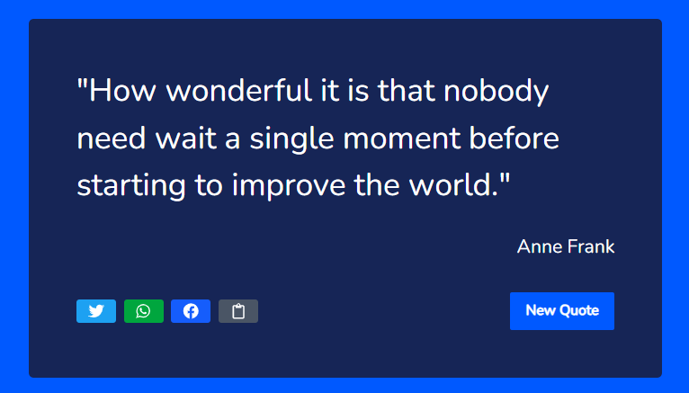

# 📜 Freddie Quote Generator

A simple and interactive **Freddie Quote Generator** built with **React** and styled using **Tailwind CSS**.  
The app fetches quotes from an external API and displays them dynamically, allowing users to:

---

## ✨ Features

- 🎲 Generate a random inspirational quote with a single click
- 👤 Display the author of the quote
- 🔗 Share quotes directly to **Twitter, WhatsApp, and Facebook**
- 🌓 Clean, minimal UI with responsive styling
- 🚀 Deployable on Vercel for easy live access

---

## 🔧 Tech Stack

- **React (Vite)** – frontend framework
- **Tailwind CSS** – styling
- **React Icons** – social media icons
- **External Quote API** – random quotes source

---

## 📸 Preview



---

## 🌍 Live Demo

👉 [View Live App](https://freddie-quote-app-imxs.vercel.app/)

---

## 💡 How It Works

1. On page load, the app fetches a random quote from the API.
2. Clicking the **New Quote** button fetches another random quote.
3. Users can instantly share the quote to **Twitter WhatsApp, or Facebook**.

---

## ⚡ Getting Started

### 1️⃣ Clone the repository

```bash
git clone https://github.com/Fredstech-ik/Freddie-Quote-App
```
